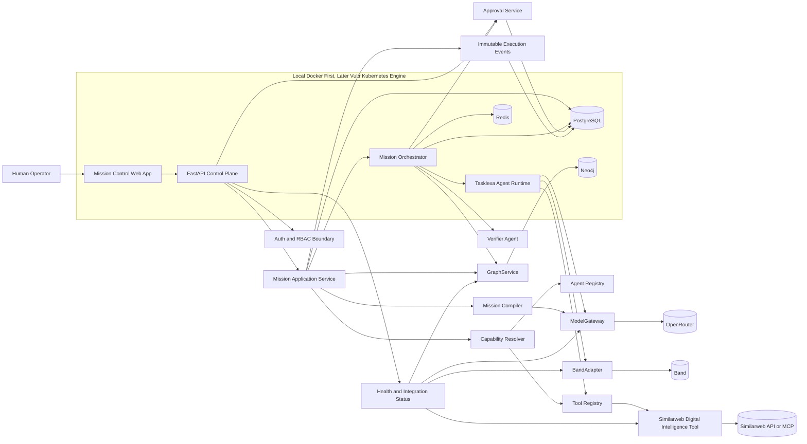
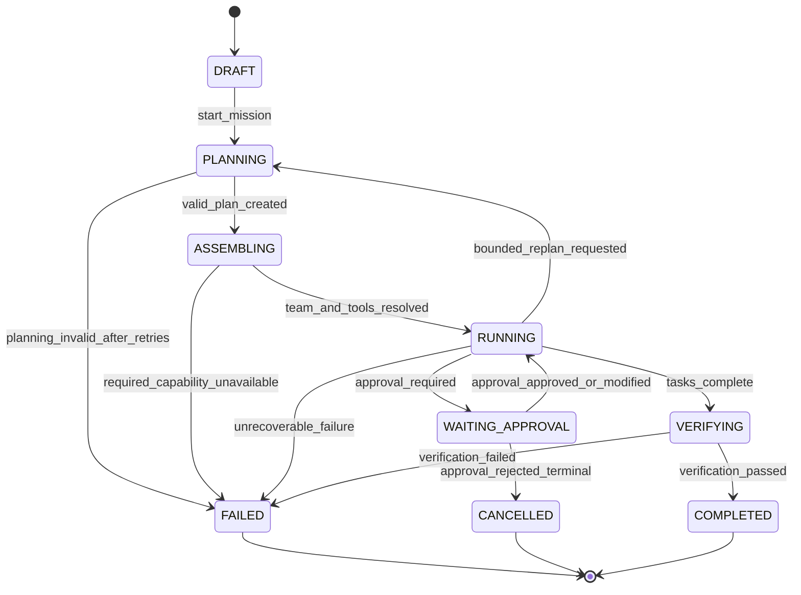
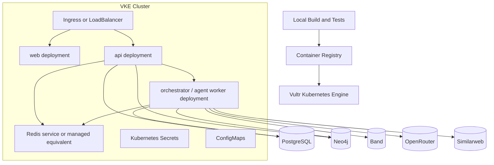

# Tasklexa Agenticos Architecture

Status: Phase 0 complete, awaiting build approval.

## Build Readiness Report

Repository status:

- Existing repository had only `README.md` before Phase 0 documentation.
- No installed application dependencies were present.
- No source architecture existed to preserve.
- Phase 0 adds documentation only; no frontend, backend, database, or runtime code has been created.

Architecture proposal:

- Use a monorepo with `apps/web` for Mission Control, `apps/api` for FastAPI, shared schemas, orchestrator services, agent runtime, integration adapters, local Docker, and Kubernetes manifests.
- PostgreSQL is authoritative for transactional mission state.
- Neo4j represents mission, task, agent, tool, evidence, decision, action, and outcome relationships.
- Redis may hold transient orchestration queues, execution locks, and short-lived cache entries.
- Band is the agent communication fabric, not the workflow engine.
- OpenRouter is the model gateway, not the planner.
- Similarweb is a discoverable external tool, never a required platform dependency.
- Vultr Kubernetes Engine is the deployment target, never business logic.

Verified provider capabilities:

- Band docs describe remote agents hosted in our infrastructure and connected through REST commands plus WebSocket events. Source: https://docs.band.ai/api/agent-api
- Band docs identify `https://app.band.ai/api/v1/agent` as the Agent API base URL and `wss://app.band.ai/api/v1/socket/websocket` for real-time events. Source: https://docs.band.ai/api/agent-api
- Band MCP docs list scoped credentials and tool server configuration, but MCP alone cannot make an agent listen for unsolicited platform events. Source: https://docs.band.ai/integrations/mcp/reference
- OpenRouter docs describe `POST /api/v1/chat/completions`, Bearer authentication, model catalog lookup through `GET /api/v1/models`, OpenAI SDK compatibility, provider routing, structured outputs, and model fallback controls. Sources: https://openrouter.ai/docs/quickstart, https://openrouter.ai/docs/guides/routing/provider-selection, https://openrouter.ai/docs/guides/routing/model-fallbacks, https://openrouter.ai/docs/guides/features/structured-outputs
- Neo4j docs identify the official Python driver package as `neo4j` and recommend `verify_connectivity()` after creating a driver. Source: https://neo4j.com/docs/python-manual/current/
- Similarweb V5 docs describe API-key authentication, Web Intelligence endpoints, and an MCP overview. Sources: https://docs.similarweb.com/api-v5/getting-started/authentication, https://docs.similarweb.com/api-v5/api-reference/website-analysis-api, https://developers.similarweb.com/docs/similarweb-mcp
- Vultr docs confirm Kubernetes can run on Vultr through fully managed VKE and that cluster configuration can be retrieved for `kubectl`. Sources: https://docs.vultr.com/support/products/vke/can-i-run-kubernetes-on-vultr, https://docs.vultr.com/products/compute/kubernetes/management/connection
- React Flow docs identify the current React package as `@xyflow/react`. Source: https://reactflow.dev/learn

Unverified assumptions:

- Band account permissions, API keys, agent identity model, exact SDK package version, and exact Python adapter interfaces are not verified against local credentials.
- OpenRouter account access, enabled models, pricing, rate limits, selected model IDs, and structured-output support for chosen models are not verified.
- Similarweb MCP access for this specific account and exact MCP tool schema are not verified. The docs indicate support can assist with other AI agents and LLM tools.
- Vultr account, VKE region, node pool sizing, container registry, DNS, TLS, and managed database choices are not verified.
- PostgreSQL, Neo4j, and Redis local versions are proposed but not pinned until Phase 1.

Required credentials:

- `OPENROUTER_API_KEY`
- Band agent key, likely `BAND_AGENT_KEY`, plus optional `BAND_USER_KEY` for human/platform operations
- Similarweb API key and MCP access details
- PostgreSQL username/password for local and deployed environments
- Neo4j username/password and URI
- Redis connection URL or host/port/password if password-protected
- Vultr API token, VKE kubeconfig, and optional Vultr Container Registry credentials
- Web application auth provider configuration, once selected

Local prerequisites:

- Docker Desktop or compatible Docker Engine
- Docker Compose v2
- Node.js LTS and npm/pnpm, exact package manager to be selected in Phase 1
- Python 3.12 or newer
- `uv` or Poetry for Python dependency management, to be selected in Phase 1
- `kubectl` for later deployment checks
- Optional: Vultr CLI for VKE operations

Risks:

- Similarweb MCP support may not expose the exact capabilities needed for autonomous tool execution without support enablement.
- Band real-time requirements mean a simple polling adapter would be architecturally wrong.
- LLM planning must be constrained by strict schemas, retries, and fail-safe transitions.
- Demo mode can create trust issues if the UI does not aggressively label mock data.
- A single-process local MVP could drift from the target distributed worker architecture unless boundaries are maintained from the start.
- Cross-store consistency between PostgreSQL and Neo4j needs explicit outbox or repair behavior.

## Architecture Diagram



## Component Responsibility Matrix

| Component | Owns | Does Not Own | Primary State |
| --- | --- | --- | --- |
| Mission Control Web | Operator workflows, graph display, approvals, evidence/timeline/integration views | Mission state transitions | API-derived state |
| FastAPI Control Plane | API contracts, validation, auth boundary, secure errors, health | Provider-specific workflow behavior | PostgreSQL |
| Mission Application Service | Mission creation, state transition commands, transactional writes | LLM planning internals | PostgreSQL |
| Mission Compiler | Natural-language objective to validated `MissionPlan` | Direct execution | Pydantic validated plans |
| Capability Resolver | Capability extraction, agent/tool matching | Permanent static chains | Registry snapshots |
| Agent Registry | Reusable agent metadata and availability | Runtime task state | PostgreSQL/config |
| Tool Registry | Tool metadata, capabilities, risk, availability | Business-specific tools in core | PostgreSQL/config |
| Mission Orchestrator | Dependency graph execution, dispatch, approval pauses, resumes, verification gates | Direct LLM mutation of state | PostgreSQL events |
| Agent Runtime | Task execution, model calls through gateway, tool calls through registry | Workflow ownership | Agent executions |
| ModelGateway | Model selection policy, OpenRouter calls, structured-output validation, usage metadata | Business state changes | Provider call records |
| BandAdapter | Collaboration rooms, participants, send/receive events, Band references, health | Planning or state authority | Band references |
| GraphService | Mission relationship graph and graph queries | Transactional authority | Neo4j projection |
| Approval Service | Approval requests, approve/modify/reject commands, resume triggers | Fake or automatic human approval | PostgreSQL |
| Verifier Agent | Independent final verification | Mission completion without evidence | Verification report |
| Observability | Structured logs, correlation IDs, provider call metadata | Secrets logging | Logs/events |

## Domain Model Summary

The core abstraction remains:

```text
GOAL -> MISSION -> TASKS -> CAPABILITIES -> AGENTS -> MODELS -> TOOLS
-> EVIDENCE -> DECISIONS -> APPROVAL -> ACTION -> VERIFICATION -> OUTCOME
```

Authoritative transactional entities:

- `Mission`
- `Task`
- `AgentDefinition`
- `AgentExecution`
- `Capability`
- `ToolDefinition`
- `Evidence`
- `Decision`
- `Approval`
- `ExecutionEvent`
- `Conflict`
- `VerificationReport`
- `Outcome`

Neo4j projection nodes:

- `Mission`
- `Task`
- `Agent`
- `Capability`
- `Tool`
- `Evidence`
- `Decision`
- `Policy`
- `Action`
- `Outcome`

More detail is in [domain-model.md](domain-model.md).

## Mission State Machine



State transition rules:

- Only application services mutate authoritative state.
- LLM outputs may recommend transitions but cannot apply them.
- `COMPLETED` requires a successful `VerificationReport`.
- `WAITING_APPROVAL` blocks action execution until an explicit approval command is recorded.
- Every transition emits an immutable `ExecutionEvent`.

## Integration Contract: Band

Purpose:

- Provide mission-scoped collaboration rooms, participant management, message routing, real-time incoming events, and communication audit references.

Verified docs:

- Agent API uses REST commands and WebSocket inbound events.
- Remote agents run in our infrastructure.
- Agent API base URL: `https://app.band.ai/api/v1/agent`.
- WebSocket URL: `wss://app.band.ai/api/v1/socket/websocket`.
- Agent messages require mentions of existing participants.
- Event types include activity records such as tool calls, tool results, thoughts, errors, and task records.

Adapter interface:

- `health() -> IntegrationHealth`
- `create_mission_context(mission_id, title) -> CollaborationContext`
- `add_participants(context_id, participants) -> ParticipantResult`
- `send_task_message(context_id, task_id, target_agent, content, metadata) -> MessageReference`
- `send_event(context_id, event_type, content, metadata) -> EventReference`
- `subscribe(context_id, handlers) -> SubscriptionHandle`
- `sync_backlog(context_id) -> list[BandEvent]`
- `disconnect(context_id) -> None`

Status model:

- `NOT_CONFIGURED` when keys are missing.
- `LIVE` only after successful authenticated API/WebSocket check.
- `FAILED` when configured but health check or runtime calls fail.
- `MOCK` only in explicit demo mode and never used as proof of integration.

Open questions:

- Exact SDK package/version and Python async APIs must be inspected before implementation.
- Required Band account setup, agent handles, and room ownership rules must be confirmed with credentials.

## Integration Contract: OpenRouter

Purpose:

- Central model access and routing through `ModelGateway`.

Verified docs:

- Direct HTTP endpoint: `POST https://openrouter.ai/api/v1/chat/completions`.
- Auth uses `Authorization: Bearer <OPENROUTER_API_KEY>`.
- Model catalog can be listed via `GET /api/v1/models`.
- OpenAI SDK can be pointed at `https://openrouter.ai/api/v1`.
- Provider routing supports a `provider` object with controls such as provider order, fallbacks, and `require_parameters`.
- Model fallback can use a prioritized `models` list.
- Structured outputs are available for compatible models through JSON-schema response format.

Gateway interface:

- `health() -> IntegrationHealth`
- `list_models() -> ModelCatalog`
- `select_model(request: ModelSelectionRequest) -> SelectedModel`
- `complete(request: ModelRequest) -> ModelResponse`
- `complete_structured(request: StructuredModelRequest, schema) -> ValidatedModelResponse`
- `estimate_cost(usage, selected_model) -> CostEstimate`

Rules:

- Do not hard-code unverified model IDs.
- Fetch or configure model IDs during implementation.
- Store the actual returned model ID per `AgentExecution`.
- Structured planner output must be Pydantic-validated before becoming workflow state.

Open questions:

- Exact model policy defaults require a live model catalog and account limits.
- Usage/cost metadata shape must be verified against a live response before declaring cost tracking verified.

## Integration Contract: Neo4j

Purpose:

- Maintain queryable relationship projection of mission execution and evidence.

Verified docs:

- Official Python driver package is `neo4j`.
- Connectivity should be verified through the driver before use.
- Cypher is the graph query language.

Service interface:

- `health() -> IntegrationHealth`
- `create_mission_graph(mission) -> GraphMutationResult`
- `add_task(mission_id, task) -> GraphMutationResult`
- `add_agent_assignment(mission_id, task_id, agent_execution) -> GraphMutationResult`
- `add_evidence(mission_id, evidence) -> GraphMutationResult`
- `add_decision(mission_id, decision) -> GraphMutationResult`
- `add_tool_usage(mission_id, task_id, tool_usage) -> GraphMutationResult`
- `add_outcome(mission_id, outcome) -> GraphMutationResult`
- `get_mission_graph(mission_id) -> MissionGraph`
- `find_agents_by_capability(capability) -> list[AgentDefinition]`
- `find_related_evidence(decision_id) -> list[Evidence]`

Rules:

- PostgreSQL remains authoritative.
- Neo4j graph writes should be idempotent.
- Failed graph projections must be visible and repairable.

Open questions:

- Whether local Neo4j Community is sufficient for all MVP graph requirements.
- Whether GraphRAG adds value in MVP; default is no until retrieval need is concrete.

## Integration Contract: Similarweb

Purpose:

- Discoverable external digital intelligence tool, selected only when a mission requires digital market intelligence, website analysis, or competitive intelligence.

Verified docs:

- Similarweb API requires API-key authentication.
- V5 Web Intelligence API covers website performance, engagement, traffic sources, and competitive positioning.
- Similarweb provides an MCP overview for Website Intelligence data in AI tools.

Tool interface:

- `health() -> IntegrationHealth`
- `metadata() -> ToolDefinition`
- `can_execute(capability, policy_context) -> ToolAvailability`
- `analyze_website(request) -> ToolResult`
- `compare_competitors(request) -> ToolResult`
- `search_market_signals(request) -> ToolResult`

Rules:

- Status is `NOT_CONFIGURED` without credentials.
- Use official MCP mechanism when credentials/access and tool schemas are verified.
- If MCP cannot be verified, keep a provider adapter marked `UNVERIFIED` or implement direct REST only after endpoint schemas are confirmed.
- Demo data is allowed only when `DEMO_MODE=true` and must be labeled `DEMO DATA` in API responses and UI.

Open questions:

- Exact MCP endpoint, transport, authentication, and tool schemas for this account.
- Similarweb credit/rate-limit behavior and error response schemas.

## Vultr Deployment Architecture



Deployment principles:

- Local Docker Compose comes before Kubernetes.
- Kubernetes manifests or Helm charts are prepared only after local MVP works.
- Do not provision paid infrastructure automatically.
- Document PostgreSQL and Neo4j deployment choices before VKE rollout.
- Use Kubernetes Secrets for credentials and ConfigMaps for non-secret runtime settings.
- Add readiness and liveness probes for web, API, and workers.

More detail is in [vultr-deployment.md](vultr-deployment.md).

## MVP Acceptance Criteria

The MVP is accepted when an operator can:

1. Open Mission Control locally.
2. Create a mission from natural language.
3. See a validated `MissionPlan`.
4. See required capabilities.
5. See dynamic agent-team selection.
6. See Band-backed agent communication or explicit `NOT_CONFIGURED` status if credentials are absent.
7. See model calls routed through `ModelGateway` and OpenRouter or explicit `NOT_CONFIGURED` status.
8. See Similarweb discovered only when required by capabilities.
9. See real Similarweb evidence or clearly marked demo data.
10. See mission relationships in Neo4j or explicit graph health failure.
11. See decisions generated from evidence.
12. See approval-required action pause execution.
13. Approve, modify, or reject the decision.
14. See approved missions resume.
15. See independent verification.
16. See completed missions only after verification passes.
17. Inspect timeline, evidence, agents, models, tools, and mission graph.

## Proposed Repository Structure

```text
apps/
  web/
  api/
services/
  orchestrator/
  agents/
  integrations/
packages/
  schemas/
  shared/
infra/
  docker/
  kubernetes/
  vultr/
docs/
  architecture.md
  domain-model.md
  integration-status.md
  runbook.md
  demo-script.md
  api.md
  decisions.md
  vultr-deployment.md
tests/
  integration/
  e2e/
```

No deviation from the requested structure is proposed in Phase 0.

## Implementation Sequence

Phase 1: Repository and local infrastructure.

- Add monorepo structure.
- Add Docker Compose for web, API, PostgreSQL, Neo4j, and Redis.
- Add `.env.example`.
- Add health endpoints skeleton.

Phase 2: Domain model and PostgreSQL.

- Implement Pydantic schemas and SQL persistence.
- Add migrations.
- Add immutable execution events.

Phase 3: Mission API and state machine.

- Implement create/read mission APIs.
- Enforce deterministic transitions.

Phase 4: OpenRouter ModelGateway.

- Implement adapter with `NOT_CONFIGURED` status.
- Add mocked unit tests and separate live test gate.

Phase 5: Agent Registry and Capability Resolver.

- Add predefined reusable agent definitions.
- Resolve teams dynamically from capabilities.

Phase 6: Neo4j Mission Graph.

- Implement `GraphService`.
- Add graph projection repair path.

Phase 7: Band collaboration.

- Implement `BandAdapter` after SDK/API inspection.
- Add REST/WebSocket health behavior.

Phase 8: Mission Orchestrator.

- Execute dependency graph.
- Dispatch ready tasks.
- Handle failure/replan states.

Phase 9: Similarweb tool integration.

- Implement discoverable tool with strict live/demo labeling.
- Prefer official MCP if verified.

Phase 10: Human approval.

- Add approval blocking and resume commands.

Phase 11: Verifier.

- Add independent verification gate.

Phase 12: Mission Control UI.

- Add dashboard, mission creation, graph, agents, timeline, approvals, evidence, and integration health.

Phase 13: Integration testing.

- Add mocked integration tests and live tests separated by credentials.

Phase 14: Demo mission.

- Add domain-neutral business visibility demo.

Phase 15: Vultr deployment.

- Add manifests and runbook after local MVP verification.

## Phase 0 Conclusion

The architecture is internally consistent if the following non-negotiable rules hold during implementation:

- PostgreSQL owns transactional state.
- Neo4j is a projection, not the workflow engine.
- Band is communication fabric, not the orchestrator.
- OpenRouter is model access, not workflow planning authority.
- Similarweb is dynamically discovered and optional.
- Mock/demo data is visibly labeled everywhere.
- Live integrations become `LIVE` only after successful authenticated checks.

PHASE 0 COMPLETE - READY FOR BUILD APPROVAL
